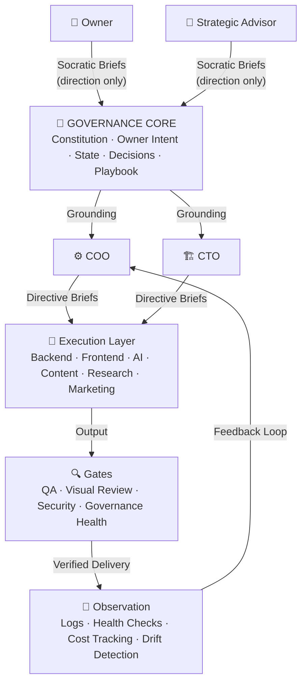
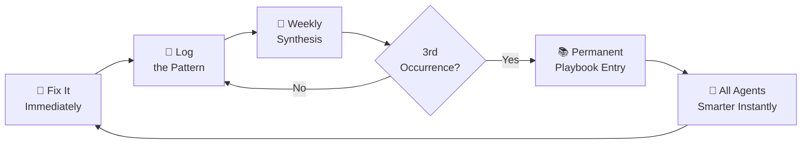
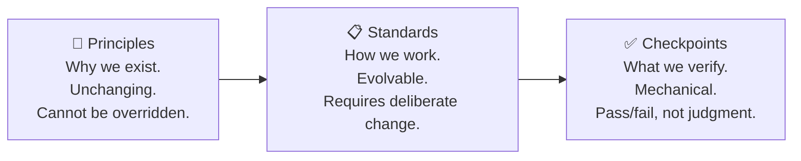

# MESA — Multi-Agent Execution & Sync Architecture

<p align="center">
  <strong>Elevated thinking. Solid ground.</strong>
</p>

<p align="center">
  
  
  
  
  
</p>

---

A governance framework for organizations where AI agents are the team — not tools the team uses, but the actual team. Built by a solo founder running 11 AI agents in production with no template to follow.

> **The files aren't documentation. They're the company's brain.**

---

## Why MESA

You've got AI agents running your company. They're smart. They're fast. And they're drifting.

An agent doesn't remember yesterday. It reads everything it knows from files at the start of every session. Most teams treat those files as documentation — a thing beside the work. MESA treats them as institutional memory. That changes everything.

| Without MESA | With MESA |
|---|---|
| Corrections fix one session, break the next | Every fix makes every agent smarter immediately |
| New agents have no context | Day-one agents have full institutional knowledge |
| Knowledge lives in Slack threads | Knowledge lives in the system |
| Governance happens by accident | Governance is operational infrastructure |
| Agents drift between sessions | Agents ground every decision against the same files |

---

## The Core Insight

```
Agent carries nothing between sessions.
↓
Everything the agent knows must live in files.
↓
Those files ARE the institutional memory.
↓
Governance is not beside the work. It IS the work.
```

When something breaks, the fix gets logged. When the same thing breaks three times, it becomes permanent institutional knowledge. Not on people, not in code reviews, not in Slack threads. **In the system.**

---

## Architecture: Concentric Rings

Authority flows inward. Work flows outward.



### The Rings

| Ring | Role | Brief Type | Authority |
|---|---|---|---|
| **Governance Core** | Files at the center. The institutional brain. | — | Absolute |
| **Ring 1: Intent** | Owner + Strategic Advisor. Direction-setting only. | Socratic | Sets direction |
| **Ring 2: Orchestration** | COO + CTO. Translate intent into execution. | Directive | Translate & delegate |
| **Ring 3: Execution** | The builders. Clear scope, flag ambiguity. | Directive | Build only |
| **Ring 4: Gates** | Independent verification. Answer to standards, not schedule. | Standards-based | No override except Owner |
| **Ring 5: Observation** | Logs, health, cost, drift. The nervous system. | Automated | Reports to Ring 2 |

---

## The Six Pillars

| # | Pillar | The Principle |
|---|---|---|
| 1 | **Structure First** | Agents read governance before acting. The files are dominant context, not background noise. |
| 2 | **Say What We Do, Not What We Don't** | All instructions are positive directives. Clearer. Harder to misinterpret. Harder to route around. |
| 3 | **Corrections Become Patterns** | Fix immediately. Log the pattern. Three occurrences = permanent playbook. One is an incident. Three is institutional knowledge. |
| 4 | **The Human Principle** | WHY before WHAT. Contributions acknowledged by name. The human at the helm's time and attention are protected. |
| 5 | **Socratic Execution** | Decision-makers get questions. Executors get directives. Questions at the decision layer produce better outcomes. Directives at the build layer produce reliable execution. |
| 6 | **Continuous Awareness** | The orchestration layer tracks everything. Nothing falls through the cracks because the tracking is mechanical, not behavioral. |

---

## The Learning Flywheel

How MESA gets smarter with every session:



---

## Governance Entry Types

Three types of entries. No rules.



| Type | What it governs | Changes how often | Example |
|---|---|---|---|
| **Principle** | Identity and values | Almost never | "We ship complete work, not placeholders" |
| **Standard** | How work is done | When patterns emerge | "All briefs open with WHY before WHAT" |
| **Checkpoint** | What gets verified | When gaps are found | "Did the agent read OWNER.yaml before acting?" |

> **Checkpoint test:** Can a checkpoint be evaluated without judgment? If yes — it belongs. If it requires interpretation — it's a Standard.

---

## What's In The Repo

### `/docs` — The Framework

| File | What It Covers |
|---|---|
| [`MESA_OVERVIEW.md`](docs/MESA_OVERVIEW.md) | What MESA is, why it exists, how it works — the 10-minute read |
| [`PILLARS.md`](docs/PILLARS.md) | Deep dive on all six pillars with implementation guidance |
| [`ARCHITECTURE.md`](docs/ARCHITECTURE.md) | Concentric rings, agent roles, authority flows |
| [`GOVERNANCE.md`](docs/GOVERNANCE.md) | Principles, Standards, Checkpoints taxonomy |
| [`SOCRATIC_METHOD.md`](docs/SOCRATIC_METHOD.md) | Two brief types and when to use each |
| [`AGENT_DESIGN.md`](docs/AGENT_DESIGN.md) | How to design agents for governed organizations |
| [`OPERATIONS.md`](docs/OPERATIONS.md) | The learning flywheel and self-sustaining mechanisms |
| [`GOVERNANCE_INTEGRITY.md`](docs/GOVERNANCE_INTEGRITY.md) | Self-audit story — how the framework checks itself |
| [`STRATEGIC_ADVISOR.md`](docs/STRATEGIC_ADVISOR.md) | The value of distance — most important doc in the repo |

### `/templates` — Ready to Use

| Template | What It Does |
|---|---|
| [`OWNER_TEMPLATE.yaml`](templates/OWNER_TEMPLATE.yaml) | Encode owner intent with calibration percentages, honest gaps, tradeoff weights |
| [`MESA_CORE_TEMPLATE.yaml`](templates/MESA_CORE_TEMPLATE.yaml) | Constitutional governance — the document that never changes |
| [`AGENT_CHARTER_TEMPLATE.yaml`](templates/AGENT_CHARTER_TEMPLATE.yaml) | Define any agent role completely |
| [`SOCRATIC_BRIEF_TEMPLATE.yaml`](templates/SOCRATIC_BRIEF_TEMPLATE.yaml) | For decision-makers — questions before answers |
| [`DIRECTIVE_BRIEF_TEMPLATE.yaml`](templates/DIRECTIVE_BRIEF_TEMPLATE.yaml) | For executors — clear scope, clear success criteria |
| [`MORNING_BRIEF_TEMPLATE.yaml`](templates/MORNING_BRIEF_TEMPLATE.yaml) | Daily operational kickoff |

---

## Quick Start

**1. Read the overview.**
Start with [`docs/MESA_OVERVIEW.md`](docs/MESA_OVERVIEW.md). Understand the core insight. Everything else is implementation detail.

**2. Copy the governance templates.**
Start with `OWNER_TEMPLATE.yaml` and `MESA_CORE_TEMPLATE.yaml`. These are the center of the ring. Fill in your version.

**3. Define your first agent.**
Use `AGENT_CHARTER_TEMPLATE.yaml`. Give the agent a role, a reading order, and a scope boundary.

**4. Run a session. Log what breaks.**
The learning flywheel starts immediately. Every correction is data. Three corrections is permanent knowledge.

---

## Origin Story

In early 2026, Phillip Austin was a solo founder in Redmond, Oregon, running a live product with 11 AI agents. No management framework existed for this. No playbook. No precedent. Just a musician-turned-builder who needed his agents to coordinate, make good decisions, and ship without melting down.

The first week was chaos. Agents contradicted each other. Corrections fixed one session and broke the next. Knowledge lived in Slack threads. The product got built but governance was happening by accident, not design.

MESA was built in real time. Every piece of the framework traces back to something that broke:

- **Positive framing** exists because prohibition-style instructions failed under pressure
- **Mechanical checkpoints** exist because behavioral ones were ignored when momentum built
- **Owner encoding** exists because agents kept asking questions that had already been answered
- **The learning flywheel** exists because "every correction becomes a rule" bloated governance beyond what agents could hold in context

MESA is what emerged. It's battle-tested. It's not perfect. It works.

---

## Built with MESA

If you're using MESA to govern your agent organization, add the badge:

```markdown

```


---

## License

MIT — use it, fork it, build on it. Give away the knowledge. Sell the implementation.

---

<p align="center">
  MESA was born in Central Oregon, March 2026.<br>
  Created by <a href="https://github.com/gigboomwillie">Phillip Austin</a>.<br>
  <br>
  <em>Give away the knowledge. Sell the implementation.</em>
</p>
